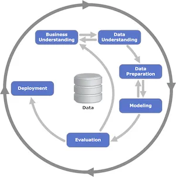

# Mlflow



Siklus hidup pembelajaran mesin yang khas dan paling banyak digunakan didasarkan pada Cross-industry standard process for data mining, yang dikenal sebagai CRISP-DM yang mencakup 6 fase:
- **Business understanding**: Jangan terjun langsung ke data! Pertama, luangkan waktu untuk memahami: Tujuan bisnis, konteks sekitar, dan kategori masalah ML
- **Data understanding:** Menjelajahi data memberi kita wawasan tentang jalur yang harus kita ikuti.
- **Data preparation**: Pembersihan data, normalisasi, pemilihan fitur, rekayasa fitur, dll.
- **Modeling**: Pilih algoritma, latih model Anda, optimalkan seperlunya.
- **Evaluation**: Uji model Anda dengan sampel yang berbeda, dengan data nyata jika memungkinkan dan putuskan apakah model tersebut sesuai dengan persyaratan kasus bisnis Anda.
- **Deployment**: Terapkan ke dalam produksi, integrasikan, lakukan pengujian A/B, pengujian integrasi, dll.

## Penggunaan untuk Pengembang
sebelum memulai pastikan untuk menggunakan python 3.10

- Clone repository:
    ```bash
    git clone https://github.com/fahmiaziz98/machine_learning.git
    ```
- Buka terminal:
    ```bash
    cd machine_learning/mlflow-scikit
    ```
- Instal Poetry: Anda dapat menginstal Poetry dengan mengikuti petunjuk di https://python-poetry.org/docs/#installation.

- Instal dependensi proyek: 
    ```bash
    make install
    ```
- Aktivkan environment
    ```bash
    make env
    ```
- Mlflow UI:
    ```bash
    make mlflow_ui
    ```
- Jalankan skrip utama: 
    ```bash
    make run
    ```
- deactivate:
    ```bash
    exit
    ```


*Catatan*: Pastikan Anda berada di direktori yang benar (yaitu, direktori yang berisi file main.py dan file pyproject.toml) saat menjalankan perintah-perintah ini.


Refrence:

- [Data](https://www.kaggle.com/competitions/house-prices-advanced-regression-techniques/data)
- [Mlflow on Collab](https://www.dagshub.com/Dean/mlflow-colab-example#:~:text=MLflow%20%2B%20Colab%20%E2%80%93%20Example%20project,a%20free%20hosted%20MLflow%20remote)
- [End-to-End Mlflow](https://medium.com/@haythemtellili/end-to-end-ml-pipelines-with-mlflow-projects-63a11baa2dd1)
- [Step-by-step managing Project with Poetry](https://realpython.com/dependency-management-python-poetry/)

- [MLOps with MLFlow](https://freedium.cfd/https://towardsdatascience.com/end-to-end-ml-pipelines-with-mlflow-tracking-projects-serving-1b491bcdc25f)
- [kaggle](https://www.kaggle.com/code/serigne/stacked-regressions-top-4-on-leaderboard/notebook)
- [Github-1](https://github.com/Nerdward/Mlops_project/blob/main/orchestration/orchestration.py)
- [Github-2](https://github.com/haythemtellili/Machine-learning-pipeline/blob/master/main.py)